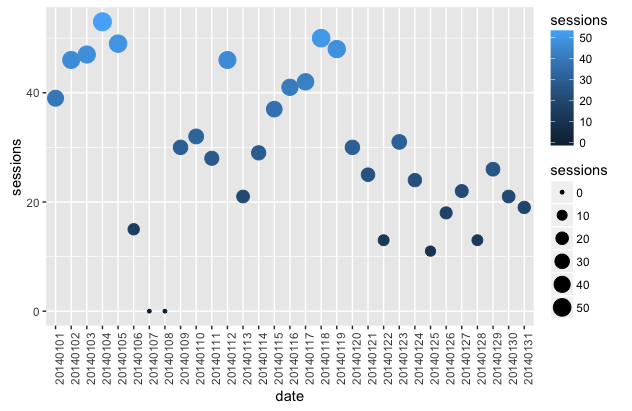
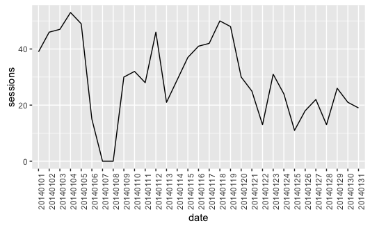
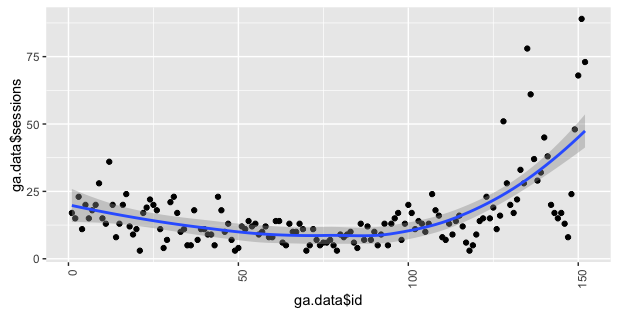

# Data visualization in R

We'll make some exploratory data analysis by visualizing data from Google Analytics in R.

R has big range of visualizing packages. My favourite is `ggplot2`.

## Package ggplot2

According to [ggplot2 project site](http://ggplot2.org/):

> ggplot2 is a plotting system for R, based on the grammar of graphics, which tries to take the good parts of base and lattice graphics and none of the bad parts. It takes care of many of the fiddly details that make plotting a hassle \(like drawing legends\) as well as providing a powerful model of graphics that makes it easy to produce complex multi-layered graphics.

Full documentation: [docs.ggplot2.org](http://docs.ggplot2.org/current/)

This is my favourite visualization package in R because of:

* Nice charts design.
* Flexibility.
* Wide range charts types.
* Extending plugins i.e. `ggtheme`.

You can also check alternatives like [Plotly](https://plot.ly/r/) or [R Base Graphic](https://flowingdata.com/2016/03/22/comparing-ggplot2-and-r-base-graphics/).

Examples in this book is made with `ggplot2`.

## Using ggplot2

### Download data to visualize in chart

In first step install \(if necessary\) and load package in current session.

```r
install.packages("ggplot2")
library("ggplot2")
```

Next build query do fetch data about date and number of session:

```r
gadata <- google_analytics(id = ga_id, 
                           start="2016-01-01", end="2016-06-30",
                           metrics = "sessions", 
                           dimensions = "date",
                           max = 5000)
```

Display first 6 rows of result:

```r
head(gadata)
```

```r
        date sessions
1 2016-01-01      199
2 2016-01-02      212
3 2016-01-03      155
4 2016-01-04      210
5 2016-01-05      192
6 2016-01-06      180
```

### Scatter plot

Plot data in time \(scatter plot\)

```r
ggplot(gadata, aes(x=date, y=sessions)) +
  geom_point()
```

As a result you will get basic scatter plot with **sessions in time**:


Poin means number of sesions in particular day.

As you see this plot isn't very nice because of a-axis labels. You can fix this using 90-degree pivot.

Add line:

```r
theme(axis.text.x = element_text(angle = 90, hjust = 1))
```

So complete example with pivoted x-axis labels:

```r
ggplot(gadata, aes(x=date, y=sessions)) +
  geom_point() +
  theme(axis.text.x = element_text(angle = 90, hjust = 1))
```

And the result:


You can also change point size depending on number of sessions by adding:

```r
size = sessions
```

```r
ggplot(gadata, aes(x=date, y=sessions, size = sessions)) +
  geom_point() +
  theme(axis.text.x = element_text(angle = 90, hjust = 1))
```

And the result:


You can also change color of points adding:

```r
color = sessions
```

\(the lighter color the highest number of sessions\).

Complete code:

```r
ggplot(gadata, aes(x=date, y=sessions, size = sessions, color = sessions)) +
  geom_point() +
  theme(axis.text.x = element_text(angle = 90, hjust = 1))
```

And the result:



This type of scatter plot is called **bubble chart**.

### Line chart

Plot data in time \(line chart\) with some styles:

```r
ggplot(gadata,aes(x=date,y=sessions,group=1)) + 
  geom_line() + 
  theme(axis.text.x = element_text(angle = 90, hjust = 1)) 
  # some styles to pivot x-axis labels
```

As a result you will get line chart with **sessions in time**:



### Scatter plot with trend line

Sometimes you want to aggregate data and see what is trend?

```r
gadata <- google_analytics(id = ga_id, 
                           start="2016-01-01", end="2016-06-30",
                           metrics = "sessions", 
                           dimensions = "date",
                           max = 5000)
```

And now we can plot data points with added trend line:

```r
ggplot(data = gadata, aes(x = gadata$date,y = gadata$sessions) ) + 
  geom_point() + 
  geom_smooth() +
  theme(axis.text.x = element_text(angle = 90, hjust = 1))
```



In this plot you can see, that trend is growing :\)

### Box plot

To make some exploratory data analysis, you can visualize your traffic in different day od week. Is your website traffic is seasonal? When are more crowded days? Let's check creating **box plot** which will illustrate distribution of number of sessions in every day of week:

Build query to download data:

```r
gadata <- google_analytics(id = ga_id, 
                           start="2016-01-01", end="2016-06-30",
                           metrics = "sessions", 
                           dimensions = c("dayOfWeek","date"),
                           max = 5000)
```

And vizualize it on boxplot:

```r
ggplot(data = gadata, aes(x = dayOfWeek, y = sessions)) + 
  geom_boxplot()
```


In Google Analytics, number of days are named with convention:

```r
0 - Sunday
1 - Monday
2 - Tuesday
3 - Wednesday
4 - Thursday
5 - Friday
6 - Saturday
```

So in this case, the highest traffic was on Thursday. Fridays are also not bad :\)

## Source code

Complete code for this example in GitHub repository:

[github.com\/michalbrys\/R-Google-Analytics\/blob\/master\/3\_data\_visualization.R](https://github.com/michalbrys/R-Google-Analytics/blob/master/3_data_visualization.R)

