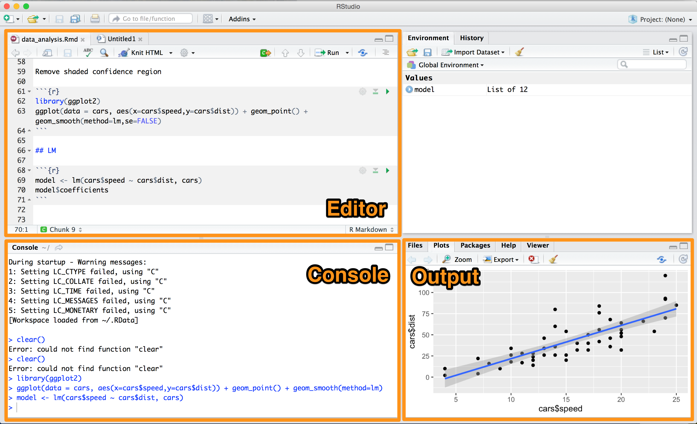

# Introduction to R

Try typing in the **console** (*the lower left corner window in R Studio*) some basic instructions. 

Commit the instructions by pressing ```[enter]``` button.



## Arithmetic operations

```r
> 1+1
[1] 2

> 2*4
[1] 8
```

## Using variables

You can assign a value to a variable using `<-` (more popular) or `=` operator. You can find some basic examples below.

### Numeric variables
```r
> x <- 1+1
> x
[1] 2
```

### Text variables
```r
> z <- "Hello world"
> z
[1] "Hello world"
```

### Vectors
```r
> v <- c(1,2,3,4,5)
> v
[1] 1 2 3 4 5
```

### Data frames

More popular than one dimensional vector is multidimensional data structure called `data.frame`.

**Data returned from Google Analytics API query will also be saved as a data.frame**

#### Creating data frame

Let's create a simple data frame (i.e. number of sessions by city in 2016-01-01)

```r
df <- data.frame(
                date = c("20160101","20160101","20160101",
                "20160101","20160101","20160101","20160101"),
                city = c("London","Warsaw","Krakow",
                "New York","Paris","Zurich","Sydney"),
                sessions =  c(101,80,70,50,30,60,20)
                )
```

To display data frame type the data frame's name: `df`

```r
> df
```

```r
      date     city sessions
1 20160101   London      101
2 20160101   Warsaw       80
3 20160101   Krakow       70
4 20160101 New York       50
5 20160101    Paris       30
6 20160101   Zurich       60
7 20160101   Sydney       20
```

#### Basic operations on data frames

To **preview a data frame** (by default first 6 rows, which IS useful for bigger datasets):

```r
> head(df)
```

```r
      date     city sessions
1 20160101   London      101
2 20160101   Warsaw       80
3 20160101   Krakow       70
4 20160101 New York       50
5 20160101    Paris       30
6 20160101   Zurich       60
```

To **display column names** of a data frame:
```r
> colnames(df)
```

```r
[1] "date"     "city"     "sessions"
```

You can **refer to column by** `dataframe$colname` operator:

```r
> df$city
```

```r
[1] London   Warsaw   Krakow   New York Paris    Zurich   Sydney  
Levels: Krakow London New York Paris Sydney Warsaw Zurich
```

And select only **unique values** of column 
(we have sessions for only one date: 2016-01-01):

```r
> unique(df$date)
```

```r
[1] 20160101
Levels: 20160101
```

You can alternatively **select columns and rows by number**:
`df[rownumber,colnumber]`

Select **column** 2:
```r
> df[,2]
```

```r
[1] London   Warsaw   Krakow   New York Paris    Zurich   Sydney  
Levels: Krakow London New York Paris Sydney Warsaw Zurich
```

Select **row** 1:
```r
> df[1,]
```

```r
      date   city sessions
1 20160101 London      101
```

Select only **one element**:

```r
> df[1,1]
```

```r
[1] 20160101
Levels: 20160101
```

These basic operations are enough to start your journey with R language :)
