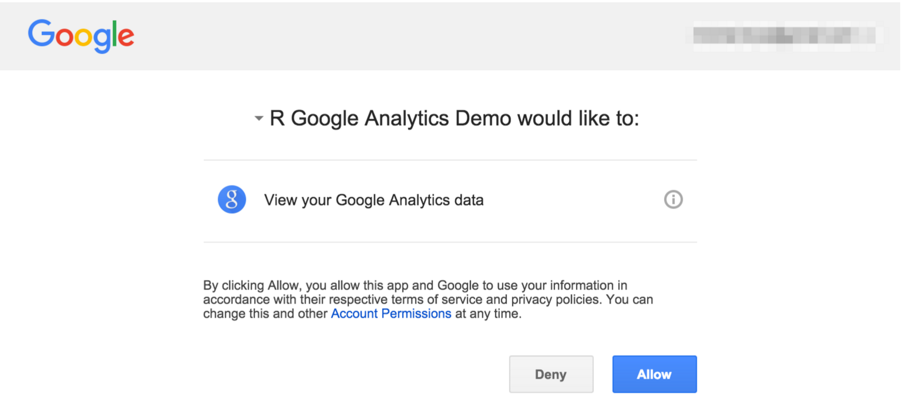
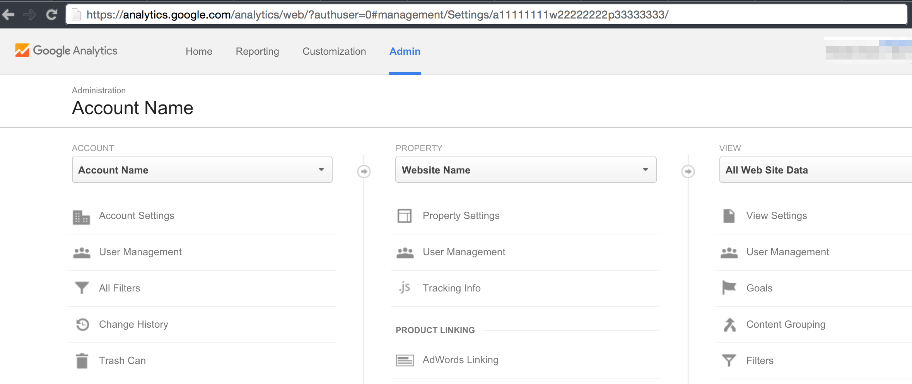

# Connection with Google Analytics

To easy download data directly from Google Analytics server to your R Studio via API interface you have to extend R Studio using external package. This package will let you to easy build query do Google Analytics servers, authorize connection and fetch the data to your computer. External packages are one of the biggest advantage of R. So let's try!

## Install package googleAnalyticsR

In first step install libraries in your R Studio.

```r
install.packages("googleAuthR")
install.packages("googleAnalyticsR")
```

When it's done, load library into current R session:

```r
library("googleAuthR")
library("googleAnalyticsR")
```

## Configure connection between R and Google Analytics API

Configure package with credentials from Google Developers Console: \(How to get it? See [Getting credentials for Google Analytics API](chapter1/gettingcredentialsfor_google_analytics_api_md_md_m.md)\)

```r
# optional - add your own Google Developers Console key
options(googleAuthR.client_id = "uxxxxxxx2fd4kesu6.apps.googleusercontent.com")
options(googleAuthR.client_secret = "3JhLa_GxxxxxCQYLe31c64")
options(googleAuthR.scopes.selected = "https://www.googleapis.com/auth/analytics")

# authorize connection with Google Analytics servers
ga_auth()
```

You will be asked about authorize R to download data from Google Analytics and your browser will open authorization page. Click **Agree**:



All done. You can now start to send queries via Google Analytics API.

## First query - "Hello world"

Make first query to Google Analytics via R:

```
## get your accounts
account_list <- google_analytics_account_list()

## pick a profile with data to query
#ga_id <- account_list[275,'viewId']

# or give it explicite using tool http://michalbrys.github.io/ga-tools/table-id.html in format 99999999
ga_id <- 00000000


# Get the Sessions by Date in 2016
gadata <- google_analytics(id = ga_id, 
                                start="2016-01-01", 
                                end="2016-06-30", 
                                metrics = "sessions", 
                                dimensions = "date", 
                                max = 5000)
```

## How to get your table.id?

For first time it may be a little tricky. The `ga_id` is parameter that identify your website data \(especially unique `view`\) on Google Analytics servers. Where to find this id?

### Tool using Google Analytics Management API

You can use my tool to get `table.id`.  
Navigate to my tool [michalbrys.github.io\/ga-tools\/](http://michalbrys.github.io/ga-tools/table-id.html) and follow instructions.

### Copy from your Google Analytics web interface link

Navigate to **Admin** section on your Google Analytics account. Select your website, property and view which you want to query.

You will see this screen:



Your Google Analytics table.id parameter is last number from URL.

So if your current URL is:

`https://analytics.google.com/analytics/web/?authuser=0#management/Settings/a11111111w22222222p33333333/`

In query parameters in R script you need do type:

```r
...
ga_id <- 33333333
...
```

## Display results

After you successfully run your first query you can check results fetched from Google Analytics.
Display first 6 rows of result:

```r
head(gadata)
```

```r
      date sessions
1 20140101       39
2 20140102       46
3 20140103       47
4 20140104       53
5 20140105       49
6 20140106       15
```

Congrats! You've downloaded first data set from your Google Analytics account!

## Source code

Complete code for this example in GitHub repository:

[https:\/\/github.com\/michalbrys\/R-Google-Analytics\/blob\/master\/1\_hello\_world.R](https://github.com/michalbrys/R-Google-Analytics/blob/master/1_hello_world.R)


